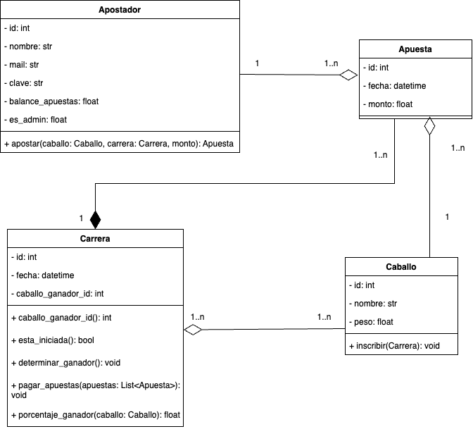
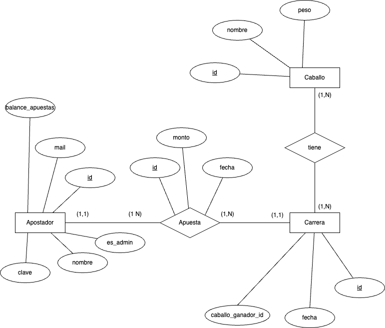

# Trabajo practico Tecnicas Avanzadas de Programacion - Apuestas de carreras de caballos

El trabajo practico de la materia de la Universidad de Palermo consiste en realizar una API 
que simule un sistema de apuestas de carreras de caballos, que debe cumplir con los requerimientos:
- El usuario debe poder visualizar el listado de carreras próximas, asì como los caballos a los cuales puede apostar, considerando cuanto paga como premio en caso de ganar.
- Se debe controlar que el usuario no haga una apuesta una vez iniciada la carrera.
- Se debe poder de forma aleatoria o bien desde un administrador, cargar el caballo ganador de la carrera.
- A partir de la determinación del ganador el sistema debe realizar (setear) el pago de la apuesta, a el o los apostadores ganadores.
- El usuario debe realizar la apuesta a partir de un acceso privado (debe validarse su identidad)

## Documentacion

Como primera entrega del trabajo practico se realizo el diagrama de clases y modelado de datos de la solucion:
 

Dejo el informe donde se detallan ademas las tecnologias a utilizar y los testeos que se realizaron [trabajo_practico](documentacion/tp_integrador_1er_etapa_nahuel_carro.pdf)

## Instalacion de programas y configuracion
Para instalar el proyecto se debe clonar el repositorio utilizando [git](https://git-scm.com/downloads), ejecutando el comando `git clone https://github.com/NahuelCarro/tp_tecnicas_avanzadas_de_programacion.git`. Ademas se debe tener instalado [docker](https://docs.docker.com/compose/install/), y tener un archivo .env como el siguiente [.env](documentacion/.env_prueba) en donde se configuran las credenciales de la base de datos. 

## Ejecucion del proyecto
Para ejecutar el proyecto se debe estar en la carpeta del proyecto clonado y ejecutar `docker-compose up --build` en la terminal. Este comando inicializara la base de datos y dejara abierto el puerto 8000 para ejecutar los endpoints de la API. 

Una vez inicializado, se puede utilizar la API y probar los endpoints, para esto se deja una coleccion de postman con los endpoints y ejemplos: [coleccion de Postman](documentacion/apuestas_de_caballos.postman_collection.json). Ademas se puede consultar la documentacion de la API en [docs](http://localhost:8000/docs#/) para ver el Swagger y ver los endpoints disponibles

Si se quiere realizar las pruebas del proyecto se debe ejecutar el comando `docker-compose run web pytest tests/` el cual ejecutara todos los tests que se encuentran en la carpeta tests del repositorio.

Para detener el proceso se debe ejecutar `docker-compose down`